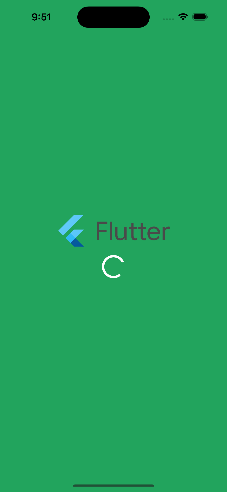
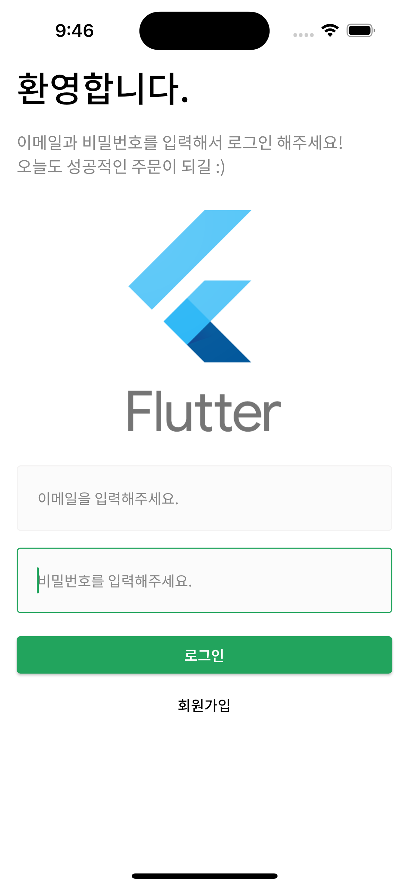
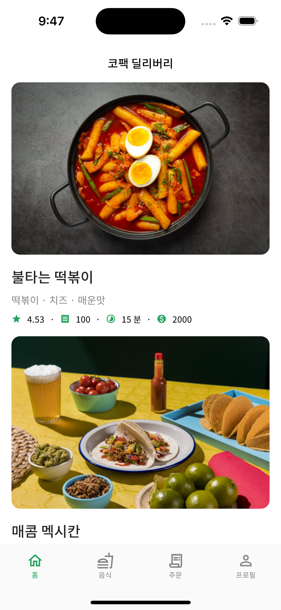
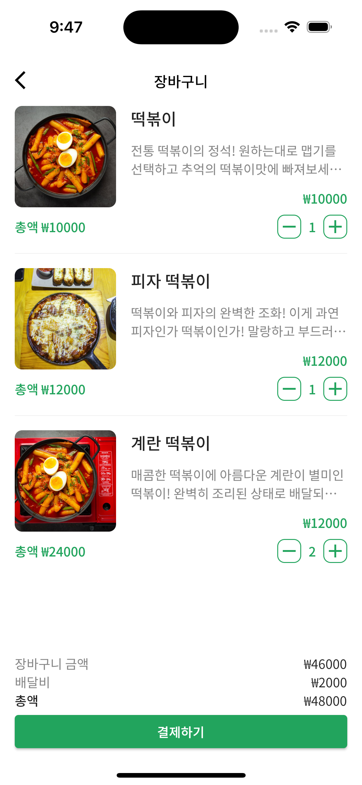
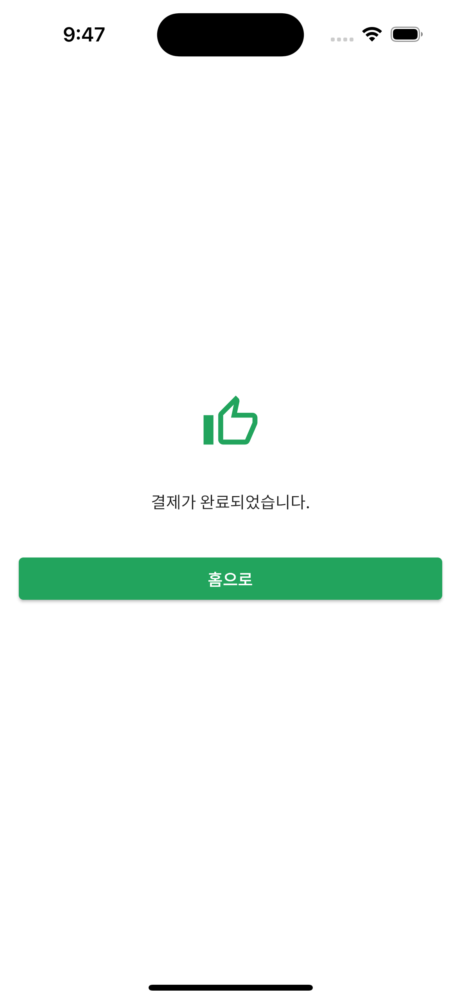
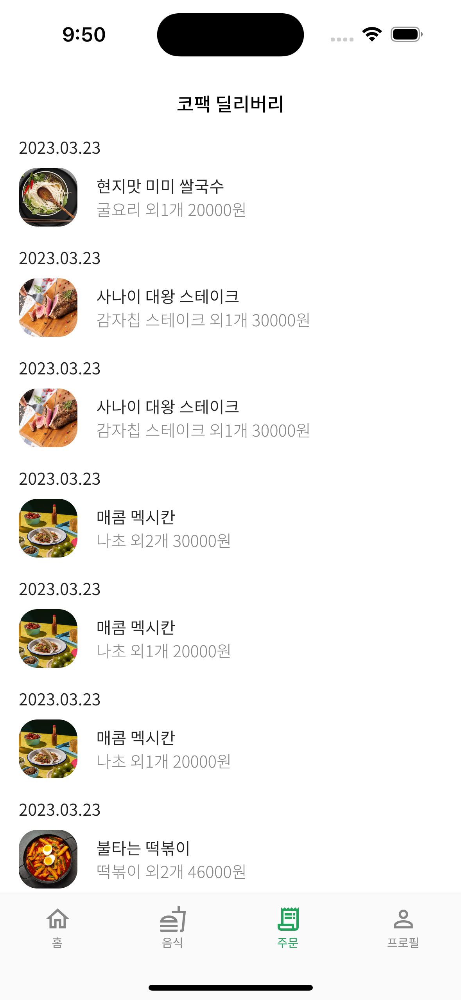

# flutter_actual_refactoring

Refactored code from Codefactory's Flutter course

----------
## 개요
인프런 플러터 강의 - [코드팩토리] [중급] Flutter 수강 완료 후 코드 리팩토링

참조 링크
1. 강의 주소 - https://www.inflearn.com/course/플러터-실전
2. 강의 코드 - https://github.com/codefactory-co/flutter-lv2-rest-api
----------
## 강의 주요 내용
+ Riverpod 상태 관리
+ Pagination 
+ JWT 토큰관리 및 인증
+ JsonSerializable
+ GoRouter
+ Retrofit
+ Dio 토큰관리 자동화
+ OOP
+ Debounce and Throttle
----------
## 리팩토링 내역
+ 라이브러리 최신 버전으로 상향 및 코드 개선
+ 패키지 구성 변경
  + 서비스 화면 별 디렉토리 분류 -> 기능 디렉토리로 분류 변경
  > as is
    > 서비스 화면
      > 기능
  > to be
    > 기능
      > 서비스 화면
+ 이미지 변경
  + 강의 과정에서 사용한 임시 이미지 삭제
  +로고 이미지를 Flutter 로고 대체
  +svg 이미지 연동
----------
### Screenshots
1. [Splash](https://github.com/koreaken/flutter_actual_refactoring)[]
2. [로그인](https://github.com/koreaken/flutter_actual_refactoring)[]
3. [레스토랑](https://github.com/koreaken/flutter_actual_refactoring)[]
4. [레스토랑 상세](https://github.com/koreaken/flutter_actual_refactoring)[]
5. [장바구니](https://github.com/koreaken/flutter_actual_refactoring)[]
6. [주문완료](https://github.com/koreaken/flutter_actual_refactoring)[]
7. [주문목록](https://github.com/koreaken/flutter_actual_refactoring)[]
8. [음식](https://github.com/koreaken/flutter_actual_refactoring)[]